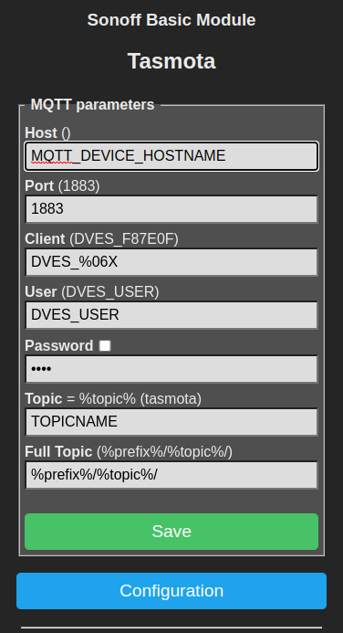
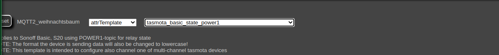

# How to setup MQTT for FHEM

- Create MQTT Broker Device in FHEM

    ```fhem
    define myBroker MQTT2_CLIENT MQTT_CONTAINER_NAME:1883
    ```

- Enable autocreate for MQTT device

    ```fhem
    attr myBroker autocreate complex
    ```

- New MQTT devices should be found automatically after restarting it. To use the device within FHEM as control, we
need to select the correct device template.

    For example, to setup a TASMOTA based device as a switch we need to define the different topic names, which we can
    find in the MQTT configuration of the device as shown here
    

    Then we can go to the device in FHEM and set the layout

    

    The corresponding topic names, if asked would be set like this:
        - command topic: cmnd/TOPICNAME
        - info topic: tele/TOPICNAME
        - ack topic: stat/TOPICNAME

    Finally, the device should be setup correctly. Feel free to rename the device to your needs.
